## SF_GIT_PJ_6
project_6
## Данные проекта

### Набор данных

**Файл:** data.csv  
[Скачать данные] (https://drive.google.com/file/d/1EijT9FgqXmmg5VLo8yyeMCkxhRXhh1Wt/view?usp=sharing)

**Файл:** data_clean_final.csv 

[Скачать данные] (https://drive.google.com/file/d/1lcujxcsd1gUbAc3A4S9jCvoYybZ7yZBF/view?usp=sharing)

**Примечание:** Для работы с проектом скачайте файлы и поместите их в корневую папку проекта.

## Визуализация данных

### Основные визуализации

**Статические графики (PNG):**
* 
* 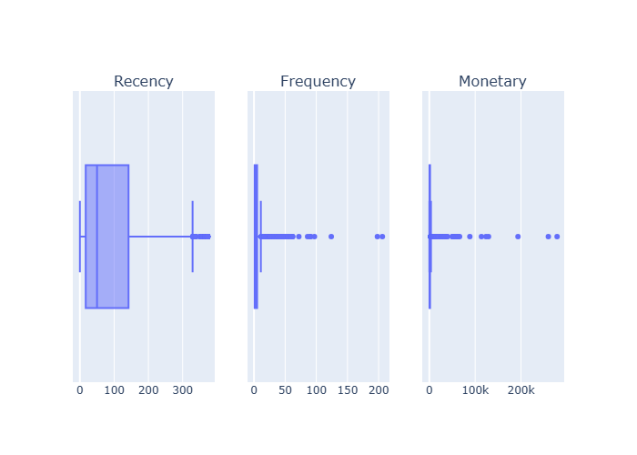
* 
* 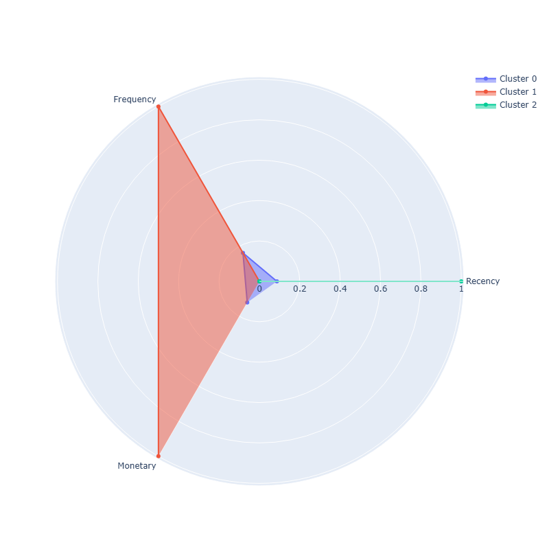
* 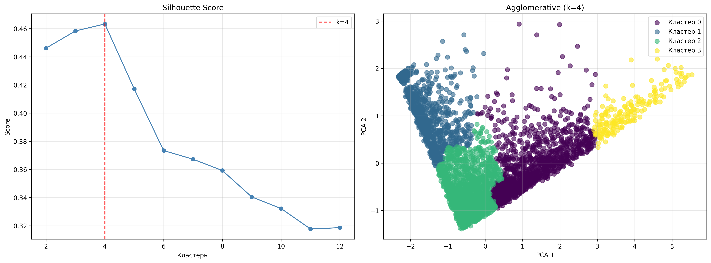
* 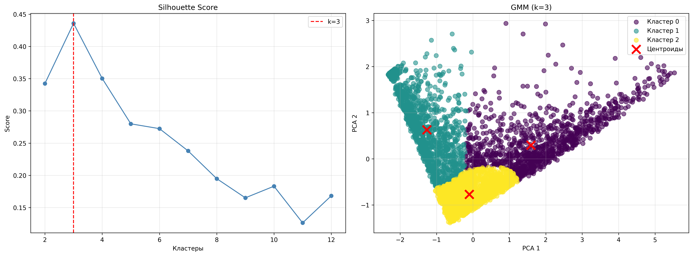
* 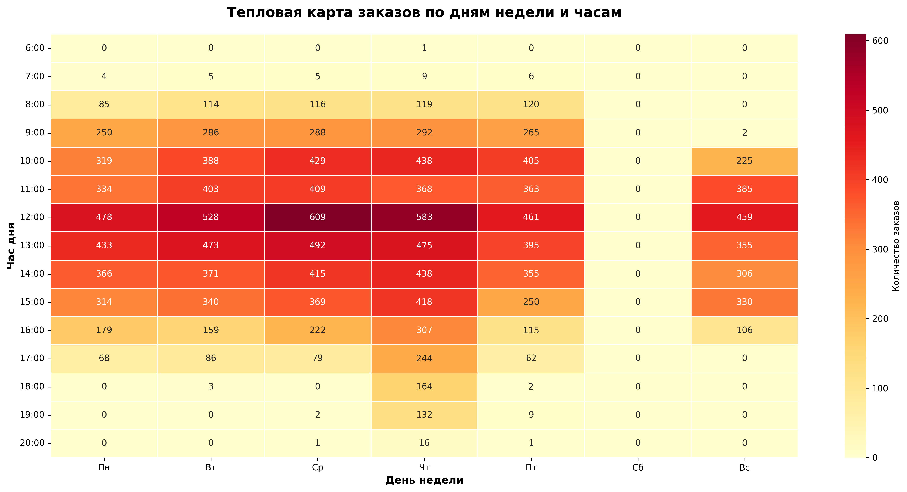
* 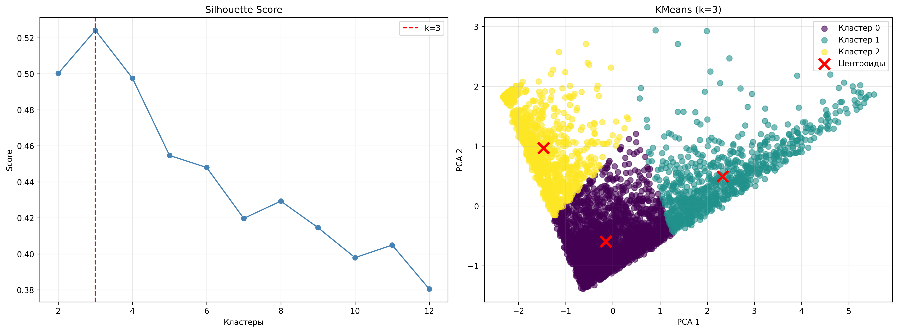
* 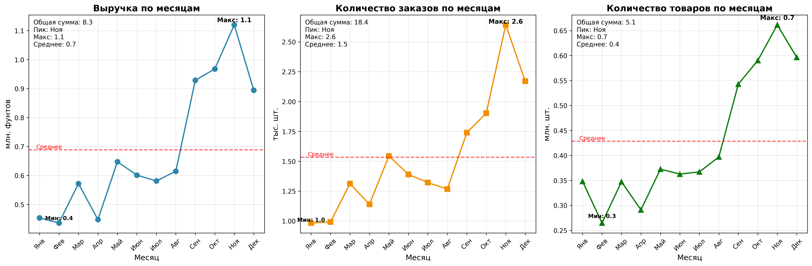
* 
* 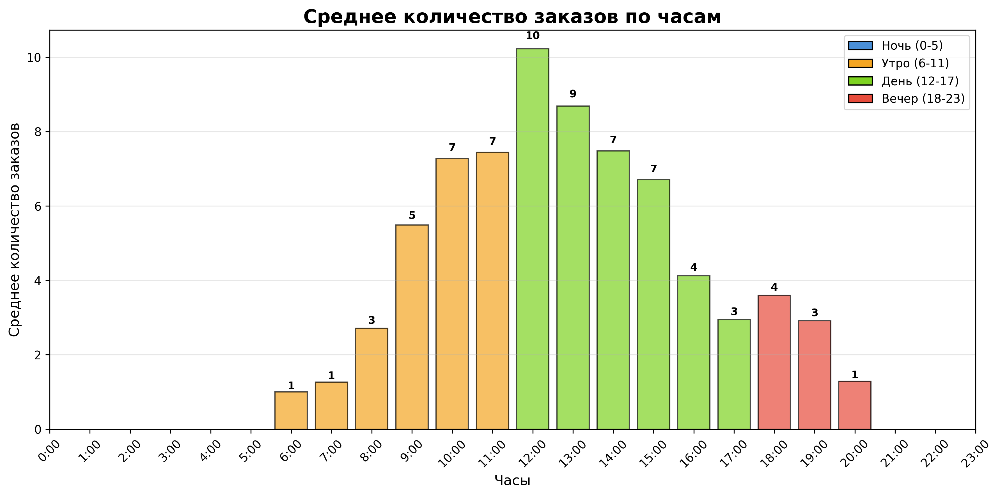
* 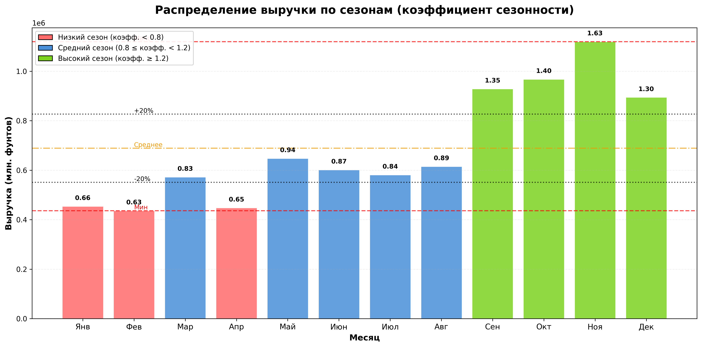
* 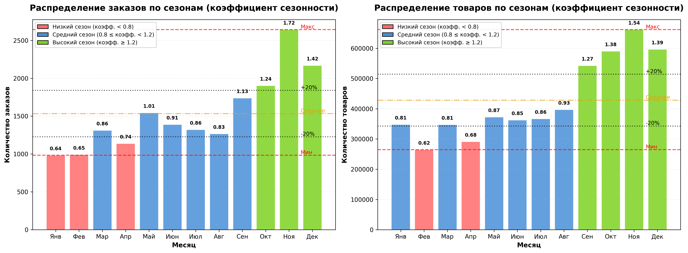
* 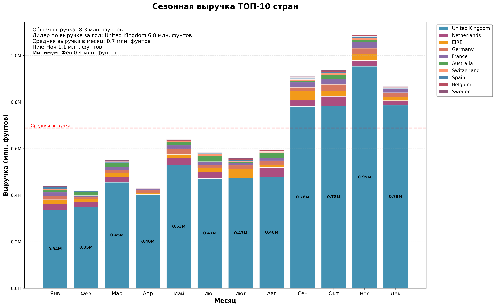
* 
* 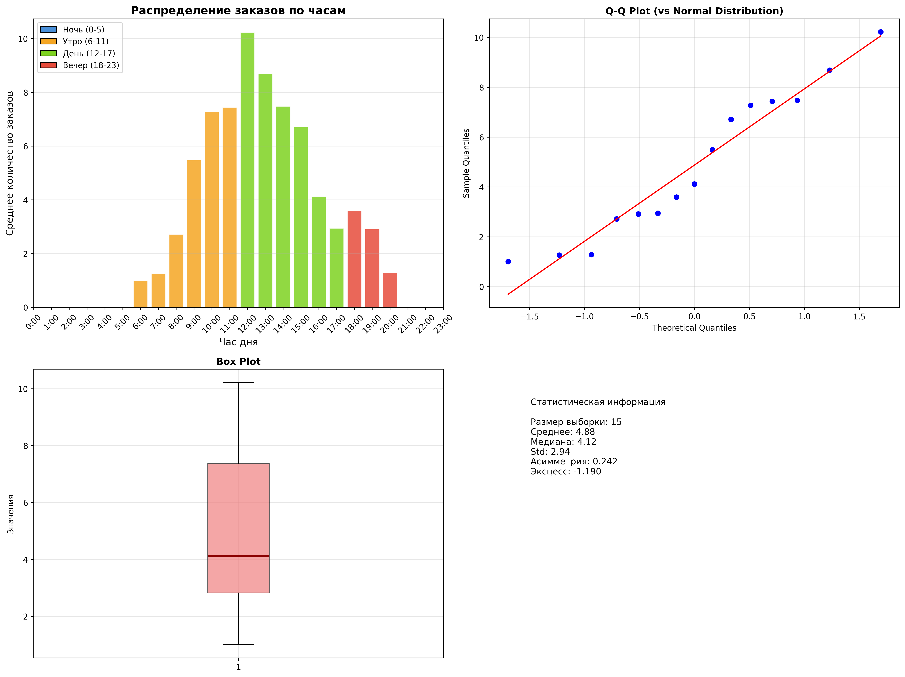
* 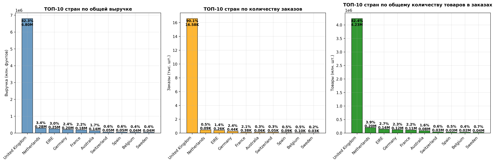

# Сегментация клиентов онлайн-магазина подарков

Маркетинг — неотъемлемая часть любого бизнеса. Для повышения прибыли компании важно понимать своего клиента, его пожелания и предпочтения. С появлением электронной коммерции, или онлайн-продаж, стало намного проще собирать данные о клиентах, анализировать их, находить закономерности и реализовывать маркетинговые кампании.

## Постановка задачи

**Описание кейса:** Проект посвящён анализу транзакционных данных онлайн-магазина подарков (базирующегося в Великобритании) за период с декабря 2010 по декабрь 2011 год [The UCI Machine Learning Repository](http://archive.ics.uci.edu/ml/index.php). Машинное обучение позволяет анализировать поведение клиентов, определять их категории (лояльные, перспективные, спящие) и выбирать правильную стратегию взаимодействия.

**Бизнес-задача:** произвести сегментацию существующих клиентов, проинтерпретировать эти сегменты и определить стратегию взаимодействия с ними.

**Техническая задача:** построить модель кластеризации клиентов на основе их покупательской способности, частоты заказов и срока давности последней покупки, определить профиль каждого из кластеров.

**Основные цели:**
- Произвести предобработку набора данных
- Провести разведывательный анализ данных и выявить основные закономерности
- Сформировать характеристики клиентов на основе RFM-анализа
- Построить несколько моделей машинного обучения, решающих задачу кластеризации клиентов
- Определить количество кластеров и проинтерпретировать их

## Описание данных

Данные представляют собой таблицу в формате CSV, в каждой строке которой содержится информация об уникальной транзакции.

Признаки, описывающие каждую транзакцию:

* InvoiceNo — номер счёта-фактуры (уникальный номинальный шестизначный номер, присваиваемый каждой транзакции; буква "C" в начале кода указывает на отмену транзакции);
* StockCode — код товара (уникальное пятизначное целое число, присваиваемое каждому отдельному товару);
* Description — название товара;
* Quantity — количество каждого товара за транзакцию;
* InvoiceDate — дата и время выставления счёта/проведения транзакции;
* UnitPrice — цена за единицу товара в фунтах стерлингов;
* CustomerID — идентификатор клиента (уникальный пятизначный номер, однозначно присваиваемый каждому клиенту);
* Country — название страны, в которой проживает клиент.

## Основные этапы решения задачи

1. **Предобработка данных**
   - Удаление записей с пропусками в идентификаторе клиента
   - Устранение дубликатов
   - Учёт возвратов товаров через признак `QuantityCanceled`
   - Исключение специальных транзакций (почтовые расходы, банковские сборы)
   - Удаление транзакций с нулевой ценой
   - Добавление признака `TotalPrice`

2. **Разведывательный анализ**
   - Анализ географии продаж (Великобритания — 82.3% выручки)
   - Выявление сезонности (пик в ноябре, коэффициент 1.63)
   - Анализ временных паттернов (пик заказов 10:00–14:00)

3. **RFM-анализ и кластеризация**
   - Построение RFM-таблицы (Recency, Frequency, Monetary)
   - Удаление выбросов по 95-му перцентилю
   - Сравнение методов: KMeans, Agglomerative Clustering, Gaussian Mixture Model
   - Выбор лучшего метода: KMeans с 3 кластерами (Silhouette Score 0.5242)

4. **Интерпретация кластеров**
   - Визуализация кластеров (3D-график, полярная диаграмма)
   - Формирование профилей каждого сегмента
   - Разработка рекомендаций по маркетинговому взаимодействию

## Использованные инструменты

**Язык программирования:** Python

**Библиотеки:**
- `pandas`, `numpy` — обработка данных
- `matplotlib`, `seaborn` — визуализация
- `plotly` — интерактивная визуализация (3D-графики, полярные диаграммы)
- `scikit-learn` — машинное обучение:
  - `KMeans`, `AgglomerativeClustering`, `GaussianMixture` — кластеризация
  - `StandardScaler`, `PCA` — предобработка и понижение размерности
  - `silhouette_score` — оценка качества кластеризации
- `scipy` — статистические тесты (Shapiro-Wilk, Jarque-Bera, D'Agostino)

## Результаты работы и их интерпретация

### Найденные сегменты клиентов

- **Лояльные клиенты:** Самые ценные клиенты: покупают часто, тратят больше всех, последняя покупка около месяца назад.
- **Перспективные клиенты:** Клиенты с потенциалом роста: умеренная активность, могут быть переведены в сегмент лояльных клиентов.
- **Спящие клиенты:** Клиенты с высоким риском оттока: более 8 месяцев не покупали, низкая активность.

### Рекомендации по работе с сегментами

- **Лояльные клиенты:** удержание и увеличение общей прибыли от взаимодействия с клиентом, программы лояльности, персональные рекомендации
- **Перспективные клиенты:** перевод в сегмент лояльные клиенты, увеличение частоты покупок
- **Спящие клиенты:** реактивация, специальные скидки, определение причин оттока

## Итоговые выводы 

Проект выполнен успешно. Выделены три чётких сегмента клиентов с различной покупательской активностью. Silhouette Score 0.5242 подтверждает хорошее качество кластеризации. Полученные результаты позволяют компании оптимизировать маркетинговый бюджет и сосредоточиться на наиболее перспективных направлениях.